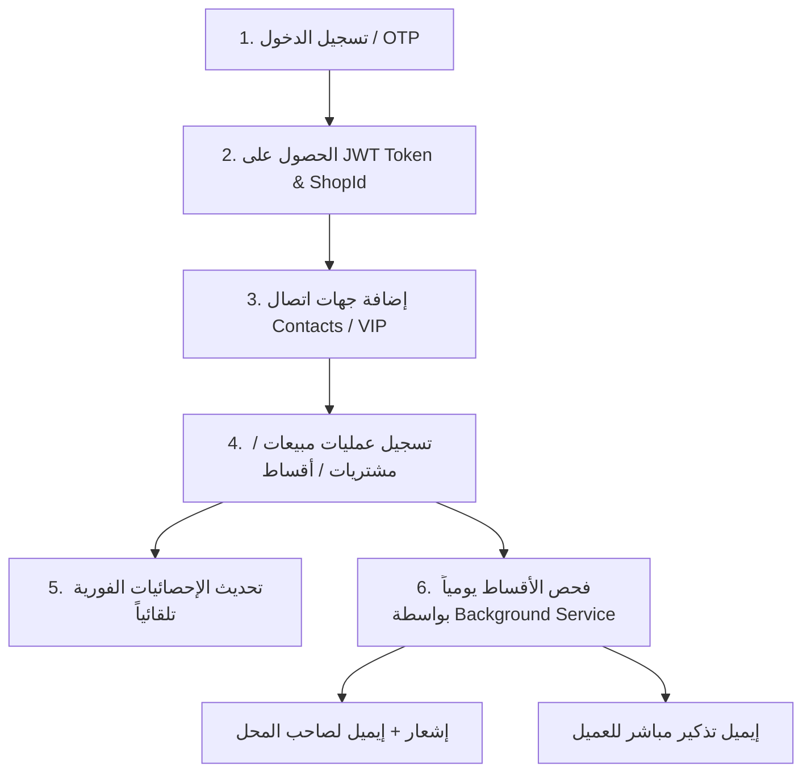

# دليل التوثيق الشامل واختبارات Postman — مشروع Mizan Backend

---

## 📑 الفهرس (Table of Contents)
1. [نظرة عامة على النظام ومعماريته](#1-نظرة-عامة-على-النظام-ومعماريته)
2. [الميزات الرئيسية (Core Features)](#2-الميزات-الرئيسية-core-features)
3. [دورة حياة وسيناريو عمل التطبيق (End-to-End Application Flow)](#3-دورة-حياة-وسيناريو-عمل-التطبيق-end-to-end-application-flow)
4. [دليل الـ Endpoints واختبارات Postman خطوة بخطوة](#4-دليل-الـ-endpoints-واختبارات-postman-خطوة-بخطوة)
   - [أ) المصادقة والحسابات (Authentication & Users)](#أ-المصادقة-والحسابات-authentication--users)
   - [ب) إدارة الأطراف والعملاء المميزين (Contacts & VIP Contacts)](#ب-إدارة-الأطراف-والعملاء-المميزين-contacts--vip-contacts)
   - [ج) إدارة العمليات والأقساط (Transactions & Installments)](#ج-إدارة-العمليات-والأقساط-transactions--installments)
   - [د) لوحة الإحصائيات الفورية (Real-Time Statistics)](#د-لوحة-الإحصائيات-الفورية-real-time-statistics)
   - [هـ) نظام الإشعارات والتذكيرات التلقائية (Notifications & Bidirectional Reminders)](#هـ-نظام-الإشعارات-والتذكيرات-التلقائية-notifications--bidirectional-reminders)
5. [جدول رموز الاستجابة والتعامل مع الأخطاء (Status Codes & Error Handling)](#5-جدول-رموز-الاستجابة-والتعامل-مع-الأخطاء-status-codes--error-handling)

---

## 1. نظرة عامة على النظام ومعماريته

نظام **ميزان (Mizan Backend)** مبني باستخدام **.NET 9** على نمط **Clean Architecture**:
- **`Mizan.Core`**: يحتوي على الكيانات (`Entities`) وقواعد التحقق الصارمة (`Domain Validation`) والاستثناءات (`DomainException`).
- **`Mizan.Application`**: يحتوي على منطق الأعمال (`Services`)، الـ DTOs، والواجهات (`Interfaces`).
- **`Mizan.Infrastructure`**: يتعامل مع قاعدة البيانات (`EF Core / SQL Server`)، خدمات البريد (`SendGrid`)، وتوليد التوكن (`JWT`).
- **`Mizan.API`**: يوفر واجهات برمجة التطبيقات (`RESTful Controllers`) مع معالجة شاملة للأخطاء (`ExceptionHandlingMiddleware`) وحماية بمعدل الطلبات (`Rate Limiting`).

---

## 2. الميزات الرئيسية (Core Features)

| الميزة (Feature) | الوصف |
|---|---|
| **1. نظام المصادقة الآمن بـ OTP و JWT** | تسجيل ودخول آمن بالبريد الإلكتروني وكود OTP مؤقت (دقيقتين)، مع دعم Refresh Tokens وإدارة الجلسات. |
| **2. نظام العمليات والإحصائيات الفورية (Feature 1)** | استبدال تقارير PDF الثابتة بـ Feed فوري وإحصائيات لحظية للمبيعات والمشتريات والتحصيلات يومياً وشهرياً. |
| **3. حساب العميل المميز (Feature 2 - VIP Contact)** | تحديد عملاء مميزين، إضافة بريد إلكتروني خاص بكل عميل، واستعراض بروفايل مالي متكامل لجميع عملياته. |
| **4. إشعارات الأقساط ثنائية الاتجاه (Feature 3 - Bidirectional Reminders)** | خدمة خلفية تفحص الأقساط يومياً وترسل إشعاراً لصاحب المحل وإيميل تذكير فوري للعميل بموعد القسط. |
| **5. نظام الأقساط والملاحظات الصوتية** | جدولة أقساط تلقائية أو مخصصة، تسجيل سداد كل قسط، وإمكانية إرفاق ملاحظات صوتية للعمليات. |

---

## 3. دورة حياة وسيناريو عمل التطبيق (End-to-End Application Flow)



---

## 4. دليل الـ Endpoints واختبارات Postman خطوة بخطوة

> **ملاحظة عامة للإعداد في Postman:**
> - المتغير الأساسي: `{{base_url}}` = `http://localhost:5000`
> - ترويسة الطلب لجميع الـ Endpoints المحمية:  
>   `Authorization: Bearer {{token}}`  
>   `Content-Type: application/json`

---

### أ) المصادقة والحسابات (Authentication & Users)

#### 1. إرسال كود OTP للدخول (`POST /api/auth/send-otp`)
- **الوصف:** يرسل كود تحقق مكون من 6 أرقام إلى البريد الإلكتروني.
- **Headers:** `Content-Type: application/json`
- **Body (JSON):**
  ```json
  {
    "email": "merchant@mizan.app"
  }
  ```
- **حالات الاستجابة:**
  - ✅ `200 OK`:
    ```json
    {
      "success": true,
      "message": "تم إرسال كود التحقق بنجاح",
      "data": { "email": "merchant@mizan.app", "expiresInSeconds": 120 }
    }
    ```
  - ❌ `400 Bad Request`: بريد إلكتروني غير صالح أو فارغ.
  - ❌ `429 Too Many Requests`: تجاوز الحد المسموح لإرسال الـ OTP (Rate Limit).

---

#### 2. التحقق من الـ OTP وتسجيل الدخول (`POST /api/auth/verify-otp`)
- **الوصف:** التحقق من الكود وتوليد `AccessToken` و `RefreshToken`.
- **Body (JSON):**
  ```json
  {
    "email": "merchant@mizan.app",
    "otpCode": "123456"
  }
  ```
- **حالات الاستجابة:**
  - ✅ `200 OK`:
    ```json
    {
      "success": true,
      "message": "تم تسجيل الدخول بنجاح",
      "data": {
        "accessToken": "eyJhbGciOi...",
        "refreshToken": "7c8e9f...",
        "expiresIn": 3600,
        "user": {
          "id": "3fa85f64-5717-4562-b3fc-2c963f66afa6",
          "email": "merchant@mizan.app",
          "shopId": "d3b07384-d113-4603-a1f9-90696e987c61"
        }
      }
    }
    ```
  - ❌ `400 Bad Request`: كود غير صحيح أو منتهي الصلاحية.

---

#### 3. تجديد التوكن (`POST /api/auth/refresh-token`)
- **Body (JSON):**
  ```json
  {
    "refreshToken": "7c8e9f..."
  }
  ```
- **حالات الاستجابة:**
  - ✅ `200 OK`: يعيد Access Token و Refresh Token جديدين.
  - ❌ `400 / 401`: Refresh token غير صالح أو منتهي.

---

#### 4. عرض بروفايل المستخدم الحالي (`GET /api/users/me`)
- **Headers:** `Authorization: Bearer {{token}}`
- **حالات الاستجابة:**
  - ✅ `200 OK`: يرجع بيانات صاحب الحساب ومحله.
  - ❌ `401 Unauthorized`: عند عدم إرسال التوكن.

---

### ب) إدارة الأطراف والعملاء المميزين (Contacts & VIP Contacts)

#### 1. إضافة طرف / عميل جديد (`POST /api/contacts`)
- **Headers:** `Authorization: Bearer {{token}}`
- **Body (JSON):**
  ```json
  {
    "name": "محمود حسن",
    "phoneNumber": "01012345678",
    "notes": "عميل منتظم في السداد"
  }
  ```
- **حالات الاستجابة:**
  - ✅ `201 Created`: تم إنشاء الطرف بنجاح مع `isVip: false` افتراضياً.
  - ❌ `400 Bad Request`:
    - الاسم فارغ أو يحتوي رموزاً غير صالحة.
    - رقم الهاتف بصيغة خاطئة.

---

#### 2. تعديل بيانات الطرف وتعيين الإيميل و VIP (`PUT /api/contacts/{id}`)
- **Headers:** `Authorization: Bearer {{token}}`
- **Body (JSON):**
  ```json
  {
    "name": "محمود حسن علي",
    "phoneNumber": "01012345678",
    "notes": "تم ترقيته لعميل مميز",
    "isVip": true,
    "contactEmail": "mahmoud.customer@example.com"
  }
  ```
- **حالات الاستجابة:**
  - ✅ `200 OK`: تم تعديل الطرف بنجاح وتحديث حالته.
  - ❌ `400 Bad Request`: صيغة بريد إلكتروني خاطئة.
  - ❌ `404 Not Found`: الطرف غير موجود أو تابع لمستخدم آخر.

---

#### 3. تحديد أو إلغاء تمييز العميل مباشرة (`PATCH /api/contacts/{id}/toggle-vip`)
- **الوصف:** تبديل حالة `isVip` للعميل بضغطة زر واحدة (من `true` إلى `false` والعكس).
- **Headers:** `Authorization: Bearer {{token}}`
- **حالات الاستجابة:**
  - ✅ `200 OK`:
    ```json
    {
      "success": true,
      "message": "تم تحديث حالة تمييز العميل بنجاح",
      "data": {
        "id": "7b0a7cb5-9852-4467-85e3-46ea317454f7",
        "name": "محمود حسن",
        "isVip": true,
        "contactEmail": "mahmoud.customer@example.com"
      }
    }
    ```

---

#### 4. عرض بروفايل العميل وعملياته بالكامل (`GET /api/contacts/{id}/transactions`)
- **الوصف:** يعرض جميع العمليات المالية الخاصة بهذا العميل مع إجمالي عدد العمليات وإجمالي مبالغها.
- **Headers:** `Authorization: Bearer {{token}}`
- **حالات الاستجابة:**
  - ✅ `200 OK`:
    ```json
    {
      "success": true,
      "data": {
        "contactId": "7b0a7cb5-9852-4467-85e3-46ea317454f7",
        "contactName": "محمود حسن",
        "phoneNumber": "01012345678",
        "contactEmail": "mahmoud.customer@example.com",
        "isVip": true,
        "totalTransactions": 2,
        "totalAmount": 750.00,
        "transactions": [
          {
            "id": "c1356f91-...",
            "type": "Sale",
            "amount": 500.00,
            "paymentMethod": "Cash",
            "transactionDate": "2026-08-18T14:30:00Z"
          },
          {
            "id": "d2467a82-...",
            "type": "InstallmentCollection",
            "amount": 250.00,
            "paymentMethod": "Cash",
            "transactionDate": "2026-08-18T16:00:00Z"
          }
        ]
      }
    }
    ```

---

#### 5. عرض قائمة العملاء المميزين فقط (`GET /api/contacts/vip?page=1&pageSize=20`)
- **Headers:** `Authorization: Bearer {{token}}`
- **حالات الاستجابة:**
  - ✅ `200 OK`: قائمة بجميع جهات الاتصال التي لديها `isVip: true`.

---

#### 6. حذف طرف ناعماً (`DELETE /api/contacts/{id}`)
- **Headers:** `Authorization: Bearer {{token}}`
- **حالات الاستجابة:**
  - ✅ `204 No Content`: تم إلغاء تفعيل الطرف.

---

### ج) إدارة العمليات والأقساط (Transactions & Installments)

#### 1. تسجيل عملية جديدة (`POST /api/transactions`)

##### حالة أ: عملية بيع نقدي سريعة (طرف حر بدون ContactId)
```json
{
  "partyName": "أحمد محمود (عميل نقدي)",
  "type": "Sale",
  "amount": 450.00,
  "paymentMethod": "Cash",
  "transactionDate": "2026-08-18T15:30:00Z"
}
```

##### حالة ب: عملية شراء بضاعة بتحويل بنكي
```json
{
  "partyName": "شركة الأمل للتوريدات",
  "type": "Purchase",
  "amount": 1200.00,
  "paymentMethod": "BankTransfer",
  "transactionDate": "2026-08-18T11:00:00Z"
}
```

##### حالة ج: عملية بيع آجل بأقساط مرتبطة بعميل
```json
{
  "contactId": "7b0a7cb5-9852-4467-85e3-46ea317454f7",
  "type": "Sale",
  "amount": 3000.00,
  "paymentMethod": "Deferred",
  "transactionDate": "2026-08-18T12:00:00Z",
  "isInstallment": true,
  "installmentPlanMode": "Automatic",
  "installmentCount": 3,
  "firstInstallmentDate": "2026-09-01T00:00:00Z",
  "frequency": "Monthly"
}
```

- **حالات الاستجابة:**
  - ✅ `201 Created`: يتم إنشاء العملية وتوليد جدول الأقساط تلقائياً.
  - ❌ `400 Bad Request`:
    - `amount <= 0` (المبلغ يجب أن يكون أكبر من صفر).
    - عدم إرسال `partyName` عند عدم وجود `contactId`.
    - تاريخ في المستقبل البعيد.

---

#### 2. تسجيل سداد قسط (`POST /api/transactions/{id}/installments/{installmentId}/pay`)
- **Headers:** `Authorization: Bearer {{token}}`
- **حالات الاستجابة:**
  - ✅ `200 OK`: تحويل حالة القسط إلى `Paid` مع تسجيل تاريخ وتوقيت السداد `PaidAt`.
  - ❌ `400 Bad Request`: القسط مسدد بالفعل مسبقاً.

---

#### 3. إرفاق ملاحظة صوتية لعملية (`POST /api/transactions/{id}/voice-note`)
- **Headers:** `Content-Type: multipart/form-data`
- **Body:** `file` (ملف صوتي: `.mp3`, `.wav`, `.m4a`, `.ogg` بحد أقصى 10MB).
- **حالات الاستجابة:**
  - ✅ `200 OK`: تم رفع وتخزين الملاحظة الصوتية بنجاح.
  - ❌ `400 Bad Request`: صيغة الملف غير مدعومة أو الحجم أكبر من 10MB.

---

#### 4. الاستماع للملاحظة الصوتية (`GET /api/transactions/{id}/voice-note`)
- **الوصف:** بث مباشر للصوت (Audio Stream مع Range Processing).

---

### د) لوحة الإحصائيات الفورية (Real-Time Statistics)

#### 1. ملخص اليوم الحالي (`GET /api/statistics/summary`)
- **الوصف:** يستدعيه الفرونت إند فور فتح التطبيق لعرض كروت الإحصائيات لليوم.
- **Headers:** `Authorization: Bearer {{token}}`
- **الرد المتوقع (200 OK):**
  ```json
  {
    "success": true,
    "data": {
      "date": "2026-08-18T00:00:00Z",
      "totalSales": 3450.00,
      "totalPurchases": 1200.00,
      "operationsCount": 3,
      "transactions": [ ... ]
    }
  }
  ```

---

#### 2. إحصائيات يوم محدد (`GET /api/statistics/daily?date=2026-08-18`)
- **Query Params:** `date` (صيغة: `YYYY-MM-DD`).

---

#### 3. إحصائيات شهر كامل (`GET /api/statistics/monthly?year=2026&month=8`)
- **Query Params:** `year` (مثال: `2026`), `month` (مثال: `8`).

---

### هـ) نظام الإشعارات والتذكيرات التلقائية (Notifications & Bidirectional Reminders)

#### 1. استعراض قائمة الإشعارات (`GET /api/notifications?page=1&pageSize=20&unreadOnly=false`)
- **Headers:** `Authorization: Bearer {{token}}`
- **حالات الاستجابة:**
  - ✅ `200 OK`: قائمة الإشعارات مرتبة من الأحدث إلى الأقدم مع تحديد حالة القراءة.

---

#### 2. عدد الإشعارات غير المقروءة (`GET /api/notifications/unread-count`)
- **الرد المتوقع (200 OK):**
  ```json
  {
    "success": true,
    "data": 4
  }
  ```

---

#### 3. تمييز إشعار كمقروء (`POST /api/notifications/{id}/read`)
- **حالات الاستجابة:** `204 No Content`.

---

#### 4. تمييز كل الإشعارات كمقروءة (`POST /api/notifications/read-all`)
- **حالات الاستجابة:** `204 No Content`.

---

#### 5. الإشعارات التلقائية ثنائية الاتجاه (Background Job)
- تعمل الخدمة الخلفية `ReminderCheckService` يومياً.
- عند حلول موعد القسط:
  1. يرسل إشعار + إيميل لصاحب المحل: `"النهارده يوم تحصيل قسط من [اسم العميل] بقيمة [المبلغ]"`.
  2. إذا كان للعميل بريد إلكتروني مسجل (`ContactEmail`)، يرسل إيميل مباشر للعميل: `"خلي بالك، [اسم صاحب المحل] هيجي يحصّل منك قسط بقيمة [المبلغ] اليوم"`.
  3. يسجل نجاح إرسال إيميل العميل في `InstallmentReminderLog.ContactEmailSent = true`.

---

## 5. جدول رموز الاستجابة والتعامل مع الأخطاء (Status Codes & Error Handling)

| رمز الاستجابة (Status Code) | المعنى | الحالات الشائعة |
|---|---|---|
| **200 OK** | نجاح العملية | استرجاع بيانات، تعديل ناجح، تبديل VIP. |
| **201 Created** | تم إنشاء مورد جديد | تسجيل عملية جديدة، إنشاء طرف جديد. |
| **204 No Content** | نجاح بدون بيانات راجعة | حذف طرف، تمييز إشعار كمقروء. |
| **400 Bad Request** | خطأ في المدخلات | مبالغ سالبة، إيميل خاطئ، بيانات ناقصة. |
| **401 Unauthorized** | غير مصرح | التوكن مفقود أو منتهي الصلاحية. |
| **404 Not Found** | غير موجود | البحث عن طرف أو عملية غير موجودة أو تخص مستخدماً آخر. |
| **429 Too Many Requests** | تجاوز معدل الطلبات | طلبات متكررة سريعة للـ OTP (حماية Rate Limiting). |
| **500 Internal Server Error** | خطأ داخلي غير متوقع | معالجة شاملة عبر الـ Middleware مع تسجيل بالـ Logger. |
